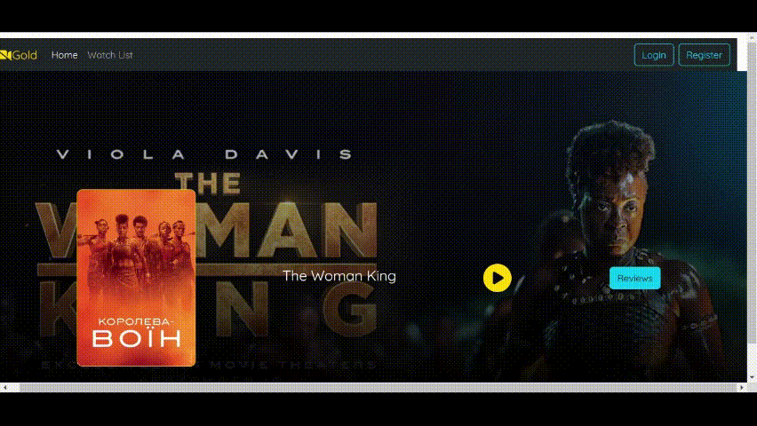

# Full-Stack Movie Review Website
## Demo

## Description
This is a backend part of the full-stack Java application that provides a platform for movie reviews. It utilizes SpringBoot for web development, MongoDB for data management, and React framework for frontend.

## Features
- RESTful endpoints for movies and reviews
- Robust testing environment
- Dynamic frontend using React
- Various website components including Home, Hero, Header, and Trailer
- Movie Reviews functionality with HTTP requests for adding and retrieving reviews  
### Frontend Src link
[movie-client](https://github.com/yifeis7/movie-client)

